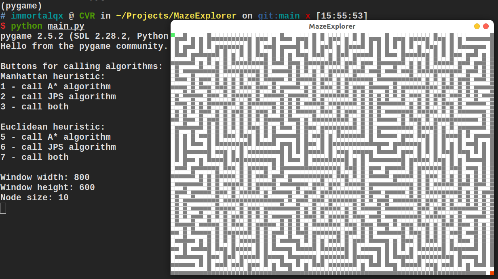

# MazeExplorer
2D迷宫小游戏，附带实现了A*算法和JPS算法，又能玩又能学~




## 文件说明

```
├── astar.py 			# A*算法实现
├── grid.py 			# 二维网格，表示二维场景
├── jps.py 				# JPS算法实现
├── main.py 			# 主函数
├── README.md 			# 说明文档
└── requirements.txt 	# 环境配置文件
```

## 环境配置

在本路径下打开终端，输入以下指令安装运行环境：

```
pip install -r requirements.txt
```

## 运行说明

在本路径下打开终端，输入以下指令运行代码：

```
python main.py 
```

根据终端输出的帮助信息，进行游戏！
